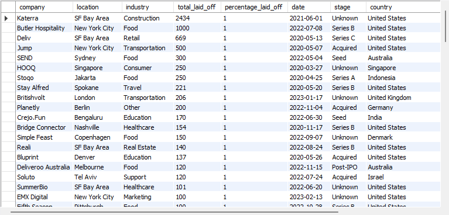
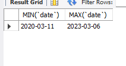
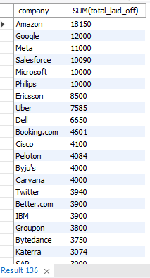
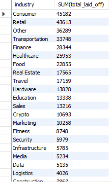
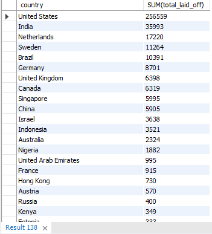
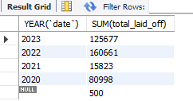
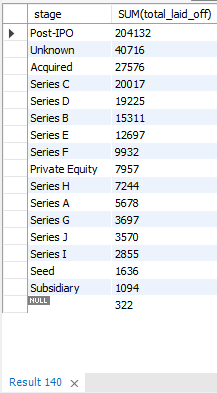
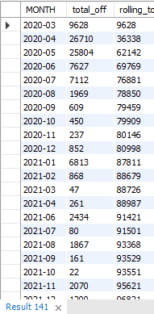
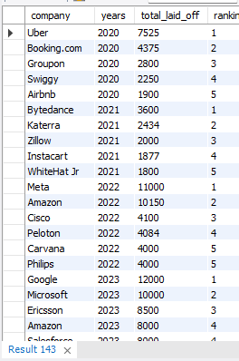

# SQL-Data-Cleaning-project-layoffs-
Following my SQL project displaying my skills.

This project analyzes global layoff data, focusing on trends in employee layoffs across various companies, industries, and countries. By examining factors such as total employees laid off and the percentage of workforce reductions, the analysis provides insights into how different industries and regions responded to economic challenges. The data, sourced from [Kaggle](https://www.kaggle.com/datasets/swaptr/layoffs-2022?resource=download), spans the early pandemic period through recent years, offering a comprehensive view of industry-wide impacts and recovery patterns. Key findings include ranking the top companies by layoffs annually and identifying patterns in workforce reductions by industry and country.

## Data Cleaning
```sql
SELECT * from layoffs;
-- Creating a copy of the dataset to avoid deleting values from the original dataset
CREATE TABLE layoffs_copy LIKE layoffs;
SELECT * FROM layoffs_copy;
INSERT layoffs_copy SELECT * FROM layoffs;
SELECT * FROM layoffs_copy;
```
### Looking for duplicates
```sql
SELECT *,
ROW_NUMBER()
OVER(PARTITION BY company, location, industry, total_laid_off, percentage_laid_off, `date`, stage, country, funds_raised_millions)
AS row_num
FROM layoffs_copy;

WITH duplicates AS
(
SELECT *,
ROW_NUMBER()
OVER(PARTITION BY company, location, industry, total_laid_off, percentage_laid_off, `date`, stage, country, funds_raised_millions) AS row_num
FROM layoffs_copy
)
SELECT * FROM duplicates WHERE row_num > 1;

-- Quick check
SELECT * FROM layoffs_copy WHERE company = 'Casper';

-- To delete only the duplicates, MySQL doesn't permit tu use DELETE. So, I am creating a new table with the 'row_num' column
CREATE TABLE `layoffs_copy2` (
  `company` text,
  `location` text,
  `industry` text,
  `total_laid_off` int DEFAULT NULL,
  `percentage_laid_off` text,
  `date` text,
  `stage` text,
  `country` text,
  `funds_raised_millions` int DEFAULT NULL,
  `row_num` INT
) ENGINE=InnoDB DEFAULT CHARSET=utf8mb4 COLLATE=utf8mb4_0900_ai_ci;

INSERT INTO layoffs_copy2
SELECT *,
ROW_NUMBER()
OVER(PARTITION BY company, location, industry, total_laid_off, percentage_laid_off, `date`, stage, country, funds_raised_millions)
AS row_num
FROM layoffs_copy;

SELECT * FROM layoffs_copy2
WHERE row_num > 1;

DELETE FROM layoffs_copy2
WHERE row_num > 1;

SELECT * FROM layoffs_copy2
WHERE row_num > 1;
```
### Standardizing data
```sql
UPDATE layoffs_copy2 -- Trimming the company name
SET company = TRIM(company);

SELECT DISTINCT industry
FROM layoffs_copy2
ORDER BY 1; -- We can merge some Crypto industry under the same label
UPDATE layoffs_copy2
SET industry = 'Crypto'
WHERE industry LIKE 'Crypto%';

SELECT DISTINCT location
FROM layoffs_copy2
ORDER BY 1; -- Looks good!

SELECT DISTINCT country
FROM layoffs_copy2
ORDER BY 1; -- Someone put a '.' after United States
UPDATE layoffs_copy2
SET country = 'United States'
WHERE country LIKE 'United States%';
```
### Changing 'date' columns into the right format
```sql
SELECT `date`,
STR_TO_DATE(`date`, '%m/%d/%Y')
FROM layoffs_copy2;
UPDATE layoffs_copy2 -- Changing format
SET `date` = STR_TO_DATE(`date`, '%m/%d/%Y');
ALTER TABLE layoffs_copy2 -- Changing column format
MODIFY COLUMN  `date` DATE;
```
### Missing Values
```sql
-- Checking if there are companies with Null values in both total_laid_off and percentage_laid off
SELECT * FROM layoffs_copy2
WHERE total_laid_off IS NULL
AND percentage_laid_off IS NULL;
```
There are Null values. What about blanks?
```sql
SELECT * FROM layoffs_copy2
WHERE industry = ''; -- Three companies have some blank values in industry. Can I repopulate it?

UPDATE layoffs_copy2
SET industry = NULL
WHERE industry = ''; -- Changing blanks into nulls

SELECT company, industry FROM layoffs_copy2
WHERE company = 'Airbnb'; -- We have values as "Travel" for Airbnb
```
### Data repopulation
```sql
-- Select industries from the same company and location
SELECT t1.industry, t2.industry
FROM layoffs_copy2 t1
JOIN layoffs_copy2 t2
    -- Joining on company and location to compare records within the same context
    ON t1.company = t2.company
    AND t1.location = t2.location
WHERE t1.industry IS NULL  -- Filtering to find records with missing industry information
AND t2.industry IS NOT NULL;  -- Ensuring we have a valid industry to repopulate

-- Update industries for records with missing information
UPDATE layoffs_copy2 t1
JOIN layoffs_copy2 t2
    -- Joining again to correlate records for the update
    ON t1.company = t2.company
SET t1.industry = t2.industry  -- Setting the industry of the first record to match the second
WHERE t1.industry IS NULL  -- Targeting only records that have NULL industries
AND t2.industry IS NOT NULL;  -- Ensuring we use a valid industry for the update

```
About other Null values in both total_laid_off and percentage_laid off, we can't repopulate them since we have no data to do so.
I think it is okay to delete them becasue I can't trust such a missing information. What if they didn't actually have layoffs?
```sql
DELETE
FROM layoffs_copy2
WHERE total_laid_off IS NULL
AND percentage_laid_off IS NULL;

-- Let's drop the old row_num column
ALTER TABLE layoffs_copy2
DROP COLUMN row_num;

SELECT * FROM layoffs_copy2;
```
## Exploratory Data Analysis
Is there at least one company that laid off every employee?
```sql
SELECT MAX(total_laid_off), MAX(percentage_laid_off)
FROM layoffs_copy2; -- There is at least a company that laid off every employee
SELECT * FROM layoffs_copy2
WHERE percentage_laid_off = 1
ORDER BY total_laid_off DESC; -- There are actually many of them
```
  
What is the time period of the dataset?
```sql
SELECT company, SUM(total_laid_off)
FROM layoffs_copy2
GROUP BY COMPANY
ORDER BY 2 DESC;
```
  
What company laid off the most employees?
```sql
SELECT company, SUM(total_laid_off)
FROM layoffs_copy2
GROUP BY COMPANY
ORDER BY 2 DESC;
```
  
What industry laid off the most employees?
```sql
SELECT industry, SUM(total_laid_off)
FROM layoffs_copy2
GROUP BY industry
ORDER BY 2 DESC;
```
  
What country laid off the most employees?
```sql
SELECT country, SUM(total_laid_off)
FROM layoffs_copy2
GROUP BY country
ORDER BY 2 DESC;
```
  
Total layoffs per year
```sql
SELECT YEAR(`date`), SUM(total_laid_off)
FROM layoffs_copy2
GROUP BY YEAR(`date`)
ORDER BY 1 DESC;
```
  
What stage laid off the most employees?
```sql
SELECT stage, SUM(total_laid_off)
FROM layoffs_copy2
GROUP BY stage
ORDER BY 2 DESC;
```
  
Let's investigate on the rolling sum of total layoffs month after month
```sql
-- Calculate total layoffs grouped by month (YYYY-MM format)
SELECT SUBSTRING(`date`, 1, 7) AS `MONTH`, SUM(total_laid_off) 
FROM layoffs_copy2
WHERE SUBSTRING(`date`, 1, 7) IS NOT NULL  -- Ensuring we're only working with valid months
GROUP BY `MONTH`
ORDER BY 1 ASC;

-- CTE to create a summarized view of layoffs by month
WITH Rolling_Total AS
(
    SELECT SUBSTRING(`date`, 1, 7) AS `MONTH`, SUM(total_laid_off) AS total_off
    FROM layoffs_copy2
    WHERE SUBSTRING(`date`, 1, 7) IS NOT NULL
    GROUP BY `MONTH`
    ORDER BY 1 ASC
)
SELECT `MONTH`, total_off,
-- Calculate rolling total layoffs up to the current month
SUM(total_off) OVER(ORDER BY `MONTH`) AS rolling_total
FROM Rolling_Total;

```
  
What are the 5 companies that laid off most of the people each year?
```sql
-- Calculate the total layoffs per company for each year
SELECT company, YEAR(`date`), SUM(total_laid_off)
FROM layoffs_copy2
GROUP BY company, YEAR(`date`)  
ORDER BY 3 DESC;  

-- CTE to create a summarized view of layoffs by company and year
WITH Company_Year (company, years, total_laid_off) AS
(
    SELECT company, YEAR(`date`), SUM(total_laid_off)
    FROM layoffs_copy2
    GROUP BY company, YEAR(`date`)  -- Grouping again for the CTE
),

-- CTE to rank companies based on layoffs per year
company_year_Rank AS
(
    SELECT *, 
    DENSE_RANK() OVER (PARTITION BY years ORDER BY total_laid_off DESC) AS ranking
    FROM Company_Year
    WHERE years IS NOT NULL
)

-- Final selection of the top 5 companies with the most layoffs per year
SELECT * 
FROM company_year_Rank
WHERE ranking <= 5;
```

